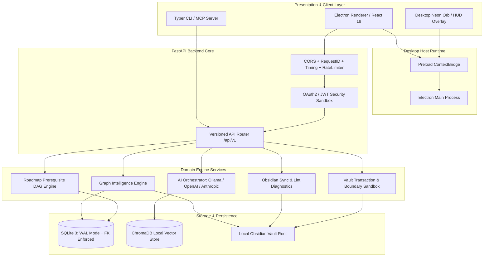

# Neuro System Architecture & Engineering Specifications

Neuro is a local-first, privacy-preserving AI second brain, knowledge graph engine, and floating desktop assistant designed to operate seamlessly offline with optional cloud sync.

---

## 1. High-Level Architectural Blueprint

---

## 2. Core Subsystems

### 2.1. Knowledge Graph Extraction & Architectural Intelligence
Neuro extracts semantic dependency graphs from codebases and notes using standard AST parsers and regex extractors:
- **AST Parsing**: Scans Python, TypeScript, JavaScript, Rust, Go, and SQL files to identify classes, functions, endpoints, and import dependencies.
- **Community Clustering (Louvain Algorithm)**: Partitions knowledge networks into modular, cohesive subsystem clusters.
- **God Node Centrality (PageRank & Degree Centrality)**: Calculates architectural keystones to identify high-risk, single points of failure.
- **Blast Radius & Impact Analysis**: Recursively calculates upstream callers and downstream dependents (up to $N$ hops) to predict ripple effects before modifying code.

### 2.2. Obsidian Vault Integration & Methodologies
- **Bidirectional Wikilink Resolution**: Parses `[[TargetNote]]` links, detects orphaned notes (zero inbound/outbound links), and identifies broken/dead links.
- **Knowledge Organization Frameworks**:
  - **PARA**: Projects, Areas, Resources, Archives.
  - **LYT (Linking Your Thinking)**: Maps of Content (MOC) and thematic routing.
  - **Zettelkasten**: Unique timestamped UIDs (`YYYYMMDDHHMM`) and atomic concept linkage.
- **JSON Canvas 1.0**: Generates native Obsidian `.canvas` files for spatial mind mapping.

### 2.3. Vault Boundary Sandboxing & Plan-Apply Transactions
- **Path Traversal Sandboxing**: Strictly resolves all relative paths against the vault root using canonical paths (`Path.resolve().is_relative_to(vault_root)`), raising `PathTraversalError` on any boundary violations.
- **Deterministic Dry-Run Plans**: Generates unified diffs and SHA-256 pre-checksum validations prior to mutation.
- **Atomic Rollback**: Restores original state from `.neuro/tx_backups` if transaction execution encounters unexpected failures.

### 2.4. Local-First Database Architecture
- **Engine**: SQLite 3 with Write-Ahead Logging (`PRAGMA journal_mode=WAL;`), synchronous normal mode, and strict foreign keys (`PRAGMA foreign_keys=ON;`).
- **Migrations**: Alembic version-controlled schema definitions.
- **Full-Text Search**: SQLite FTS5 virtual tables (`note_fts`) for sub-millisecond local keyword queries.
