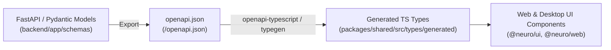

# OpenAPI & Contract-First Type Generation Guide

Neuro employs a contract-first architecture where the backend FastAPI and Pydantic schemas serve as the single source of truth for all network contracts.

---

## 1. Architecture Flow



---

## 2. Generating Types

### Step 1: Export OpenAPI JSON from FastAPI Backend
When the FastAPI backend is running locally, download the OpenAPI specification:
```bash
curl http://localhost:8000/openapi.json -o docs/api/openapi.json
```
Or use the automated export script:
```bash
python -m backend.scripts.export_openapi --output docs/api/openapi.json
```

### Step 2: Generate TypeScript Types
Run the workspace typegen script:
```bash
pnpm run typegen
```
Or execute `openapi-typescript` directly:
```bash
npx openapi-typescript docs/api/openapi.json -o packages/shared/src/types/generated.d.ts
```

---

## 3. Using Generated Types in Services & Components

Always import types through `@neuro/shared` or `@neuro/shared/types`:

```typescript
import { Note, AgentSuggestion, SuggestionAction } from '@neuro/shared';
import { apiClient } from '../services/apiClient';

export async function fetchNoteById(noteId: string): Promise<Note> {
  return apiClient.get<Note>(`/notes/${noteId}`);
}
```

---

## 4. CI/CD Validation
During CI runs, a contract check ensures that frontend types match the latest backend OpenAPI schema without drift:
```bash
pnpm --filter @neuro/shared typecheck
pnpm --filter @neuro/web typecheck
```
